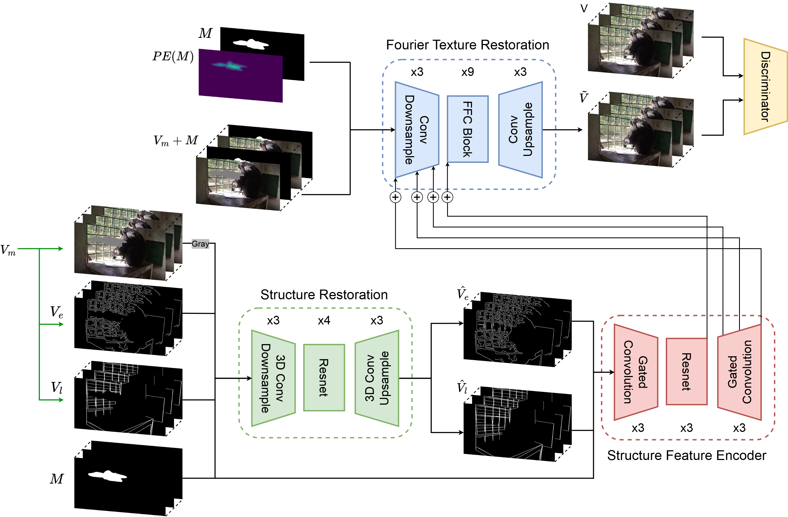

# Enhancing Regional Video Inpainting with Structural Guidance
by [ChunWei Yang](https://github.com/BensonYang1999), YuChee Tseng, YenAnn Chen

> [!IMPORTANT]  
> This work is referencing to [SERVI](https://github.com/muxi1998/SERVI) and [ZITS](https://github.com/DQiaole/ZITS_inpainting)



<!-- ### TODO:
- [ ] Overall Workflow figure
- [ ] Data preparing workflow figure
- [ ] TSR training code re-organized
- [ ] FTR training code re-organized
- [ ] Bug of VFID score shown during training process
- [ ] Wvaluation process 
- [ ] Future work list
- [ ] Fix bug of compute summary -->


## Dataset
### 1. YoutubeVOS
[Official Website](https://youtube-vos.org)

### 2. DAVIS
[Official Website](https://davischallenge.org)

## Pretrain model
The downloaded files should be organized as a folder under ./ckpt

<!-- OneDrive Link: [FTR_model (1024_SERVI)](https://1drv.ms/f/s!AuoSU7-7YWU1hbAOOs1G8sgpSJTpSQ?e=v6djZ7),  [TSR_model (0521_YoutubeVOS)](https://1drv.ms/f/s!AuoSU7-7YWU1hbAVZVR4FcLBkk7sBA?e=0qjpkv) -->
Link: [NAS](https://embedded-ai.direct.quickconnect.to:5588/sharing/VCt1spACb)

## Train
### SR model
* Template
    ```
    python3 TSR_train_video.py --name <model_name> --dataset_root ./datasets --dataset_name <YouTubeVOS/DAVIS> --batch_size 64 --train_epoch 500 --gpus 2 --DDP --cnn
    ```
* Example:
    ```
    python TSR_train_video.py --name 0423_TSR_gray_cnn_seqidx --batch_size 64 --gpus 2 --train_epoch 500 --DDP --cnn
    ```

### FTR model
* Template
    ```
    python3 FTR_train_video.py --model_name <model_name>
    ```
* Example:
    ```
    python3 FTR_train_video.py --model_name 1011_FTR
    ```

## Inference

### SR model
* Template
    ```
    python3 TSR_inference_video.py --cnn --ckpt_path <ckpt_dir> --dataset_root ./ --dataset_name <data_foler_name> --save_url <save_folder>
    ```
* Example:
    ```
    python TSR_inference_video_prob.py --cnn --ckpt ckpt/0423_TSR_gray_cnn_seqidx/best_clean.pth --save_url 0423_TSR_gray_cnn_seqidx
    ```

### FTR model
* Template
    ```
    python3 FTR_inference_video.py --path <ckpt_folder> --input <data_folder_name>
    ```

* Example:
    ```
    python FTR_inference_video.py --path ckpt/1011_FTR
    ```

> [!NOTE]  
> The testing data reading procedure is wrote in src/utils.py with the function get_frame_mask_edge_line_list (It's Still Ugly)

## Evaluation
### TSR model

### FTR model
Evaluate the metrics (PSNR/SSIM/LPIPS/VFID/VIF) between inpainted video and GT video
* Template
    ```
    python3 cal_scores.py --path <inpainting_result_folder> [--mask]
    ```

* Example:
    ```
    cd evaluation
    python cal_scores.py --path /<root_path>/results/1011_FTR/youtubevos
    ```

Evaluate the Laplacian Variance (sharpness) of inpainted video
* Template
    ```
    python3 cal_blur.py --path <inpainting_result_folder> [--mask]
    ```
* Example:
    ```
    cd evaluation
    python cal_blur.py --path /<root_path>/results/1011_FTR/youtubevos
    ```
